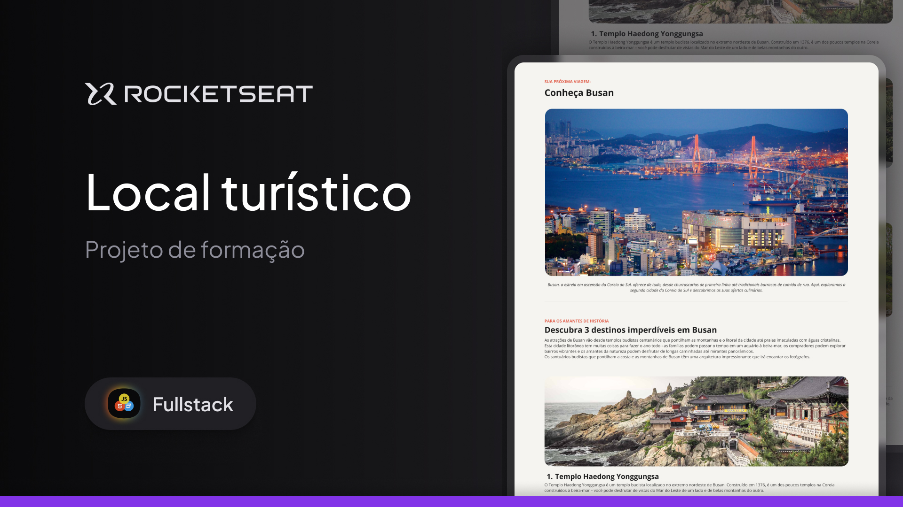

<h1 align="center"> Local Turístico </h1>

<h2>Fala dev 👋🏼<h2>
Boas-vindas ao Desafio prático Local Turístico
Este projeto é uma página web desktop com informações sobre um local turístico.
Esse é um dos desafios práticos da formação Fullstack, um dos conteúdos de especialização da Rocketseat.

  <a href="#-tecnologias">Tecnologias</a>&nbsp;&nbsp;&nbsp;|&nbsp;&nbsp;&nbsp;
  <a href="#-projeto">Projeto</a>&nbsp;&nbsp;&nbsp;|&nbsp;&nbsp;&nbsp;
  <a href="#-layout">Layout</a>&nbsp;&nbsp;&nbsp;|&nbsp;&nbsp;&nbsp;
  <a href="#memo-licença">Licença</a>

  

 

  

## 🚀 Tecnologias

Esse projeto foi desenvolvido com as seguintes tecnologias:

- HTML e CSS
- Git e Github
- Figma

## 💻 Projeto

Nesse projeto você vai desenvolver uma página simples de receita.

- [Acesse o projeto finalizado, online](https://caiovinicius-full-stack.github.io/Desafio-pratico-Local-Turistico-Rocketseat/)

## 🔖 Layout

Você pode visualizar o layout do projeto através [DESSE LINK](https://www.figma.com/community/file/1384542229391733447). É necessário ter conta no [Figma](https://figma.com) para acessá-lo.

## :memo: Licença

Esse projeto está sob a licença MIT.

---

Feito com ♥ by Rocketseat :wave: [Participe da nossa comunidade!](https://discord.gg/rocketseat)
